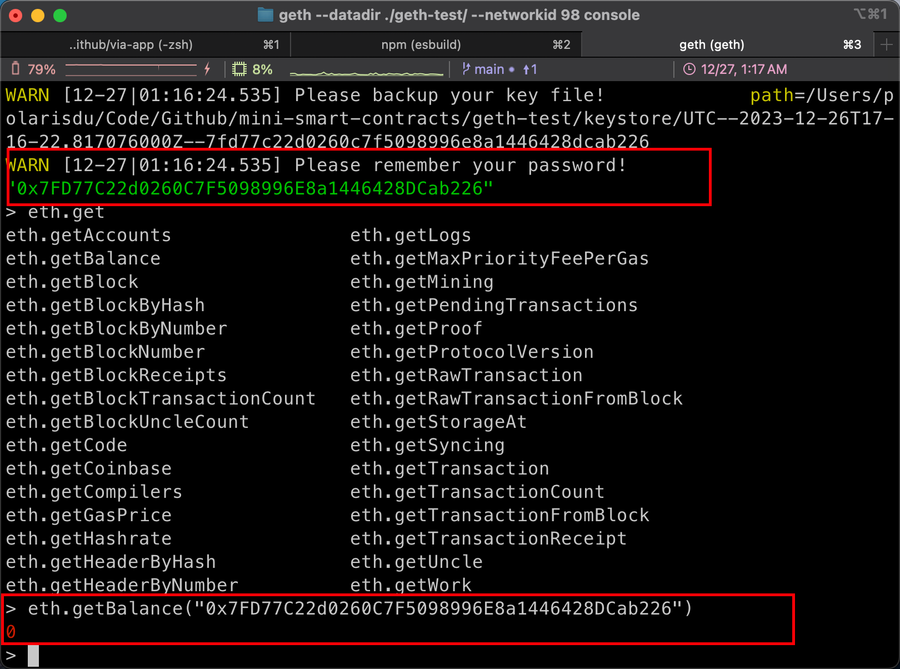

# mini-smart-contracts
> 本工程仅用于演示如何创建一个简易版的合约


1. 创建初始化区块信息并进入 geth 界面
> 这里为了便于快速进入 console，我把他保存在了 npm script 中了
```bash
# 初始化创世区块信息
geth --datadir ./geth-test/ init genesis.json

# 进入 Geth 命令行交互页面
geth --datadir ./geth-test/ --networkid 98 console --rpc.enabledeprecatedpersonal
```


2. 进入 console，创建 EOA 账户并查询当前地址余额
``` bash
# 创建 EOA 账户
> personal.newAccount()

# 创建账户后，我这里的地址是 ：0x7FD77C22d0260C7F5098996E8a1446428DCab226，我们用这个人地址获取当前余额
# 获取当前地址余额（此时值为 0）
> eth.getBalance("0x7FD77C22d0260C7F5098996E8a1446428DCab226")

#  退出 console，启动挖矿
geth --datadir ./geth-test/ --networkid 98 --mine --minerthreads=1 --miner.etherbase=0x7FD77C22d0260C7F5098996E8a1446428DCab226

# 获取当前地址余额
> eth.getBalance("0x7FD77C22d0260C7F5098996E8a1446428DCab226")
```


3. 接下来编写一份名为 helloworld 的合约，编译并生成 abi 参数
```bash
# 通过 npm 安装 solc
npm i -g solc

# 获得 EVM 二进制码
solcjs --bin contracts/helloworld.sol

# 生成 ABI 部署参数
solcjs --abi contracts/helloworld.sol
```
4. 进入 console，开始部署
```bash
# code，太长了，复制 bin 里的二进制码
> code="608060405234801561...008170033"
> abi=[{"inputs":[],"stateMutability":"nonpayable","type":"constructor"},{"inputs":[],"name":"getGreeting","outputs":[{"internalType":"string","name":"","type":"string"}],"stateMutability":"view","type":"function"},{"inputs":[],"name":"greeting","outputs":[{"internalType":"string","name":"","type":"string"}],"stateMutability":"view","type":"function"}]

# 这一步解锁账户，用于方便部署合约 
> personal.unlockAccount("0x7FD77C22d0260C7F5098996E8a1446428DCab226") 

# 使用上述定义的abi变量生成合约信息 
> myHelloWorld=eth.contract(abi) 

# 注入code信息，激活合约
> contract=myHelloWorld.new({from:"0x7FD77C22d0260C7F5098996E8a1446428DCab226",data:code,gas:1000000})

# 通过 txpool 来查看未确认的交易
> txpool.status
```

